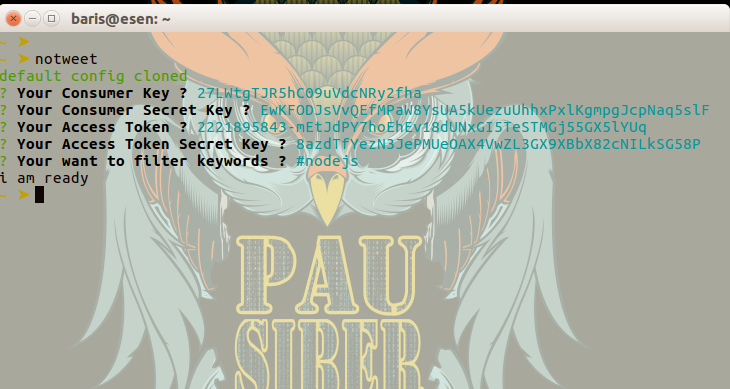
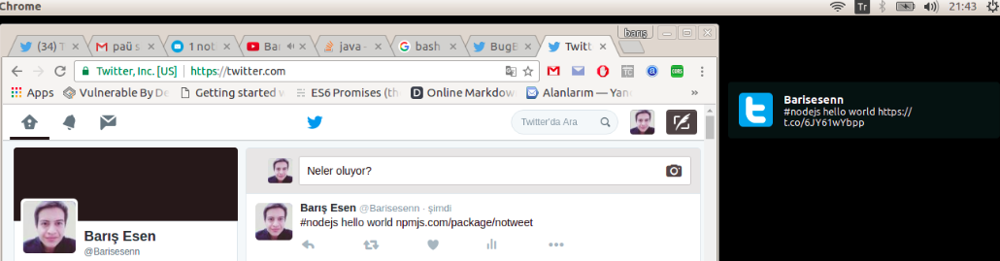

# notweet

## Follow your tweet in desktop notification !

```
// Install
  npm i -g notweet
```

```
// run
  notweet
```

```
  notweet -n "nodejs npm javascript" // Change listening keywords
  notweet -c // Close notweet :(
```

> **Requirements:**

> - Twitter app **consumer_key**
> - Twitter app **consumer_secret**
> - Twitter app **access_token**
> - Twitter app **access_token_secret**
> - The words you want to follow on Twitter example: #nodejs




